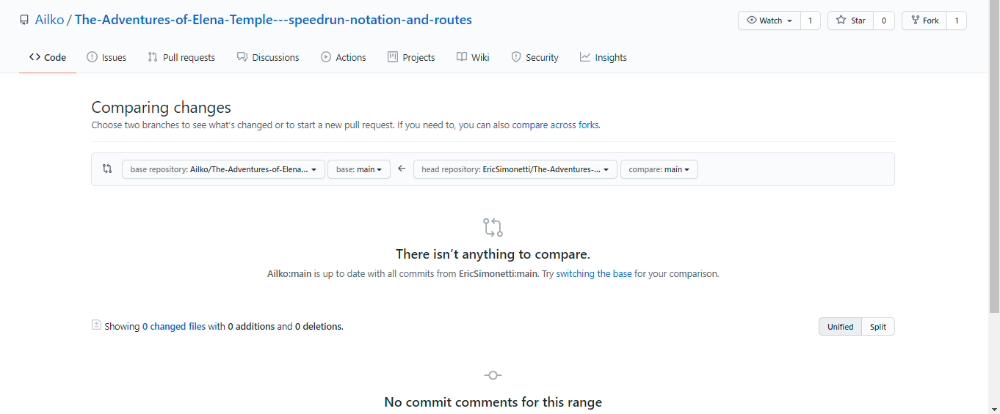
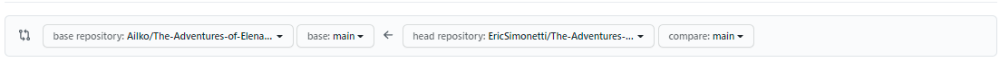

# How to contribute
If you have changes to the book you want to make there are two ways to go about this:

## Create an issue
On our GitHub page in the top banner there is a tab called `Issues`, go to this tab and you are able to create an issue. This could be an idea for a new section or some mistakes you might've found.

## Forking
If you want to fix the mistakes you found yourself or add routes you can press the fork button in the top right corner of the screen. This will create a sort of copy of the repository to your account.
There, you can edit the parts you feel need editing. After you are done editing you can create a pull request. This is done by going to the `Pull requests` tab at the top, once there you press `new pull request`.
When you are on the new pull request screen will be a hyperlink named `compare across forks`. This should bring you to a page like this:

Pay close attention to this part:

The left side of this **has** to be `Ailko/The-Adventures-of-Elena-Temple---speedrun-notation-and-routes` and `main`. The right side should be the repo and branch you want to merge.
Then you can press `Create pull request`. After this you can enter a title for the request, please keep this clear but brief, and a description of the changes you made.
Lastly you have to press `Create pull request` one last time. After this one of the curators will review your request, they might ask to make some changes before accepting it or outright delete the request, for this they have to provide a clear reason in the comments.

Thanks you in advance for adding to the document!
